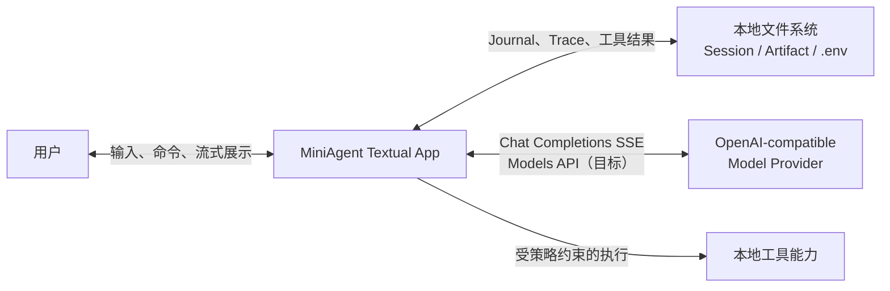
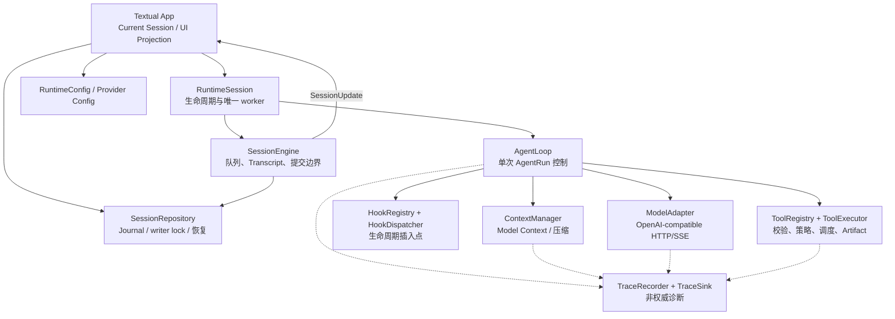
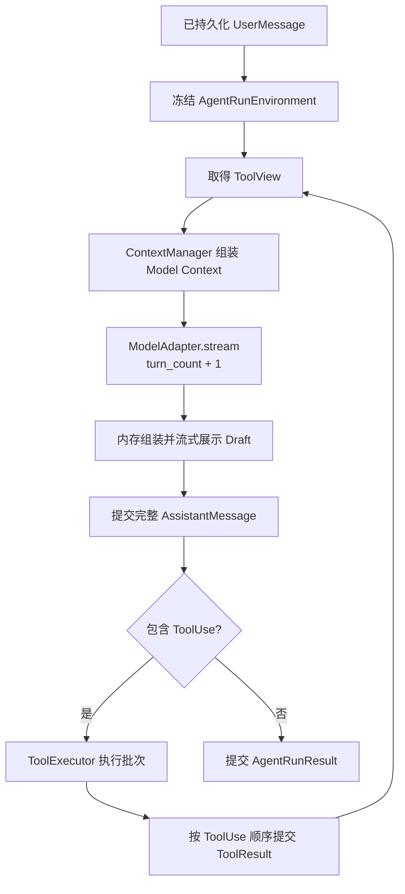

# MiniAgent 架构

## 1. 文档定位

本文是 MiniAgent 的项目级架构入口，说明系统边界、模块职责、运行时协作、状态所有权、持久化模型和当前代码落点。领域术语以根目录 [`CONTEXT.md`](../CONTEXT.md) 为准；各模块的详细契约以 [`docs/design-docs/`](design-docs/) 下的设计文档为准。

MiniAgent 是一个本地、单 UI、单活动会话的 Agent Runtime。用户可以保存多个彼此隔离的 Session，但一个进程同一时刻最多运行一个 Current Session。系统围绕一个原则组织：恢复事实、运行控制、外部能力和展示状态必须由不同边界拥有，任何模块都不能绕过 `SessionEngine` 修改 Transcript。

本文同时记录两种状态：

- **目标架构**：设计文档规定的稳定边界和不变量；
- **当前实现**：仓库代码已经落地的模块，以及尚未完全达到目标契约的部分。

## 2. 系统上下文



MiniAgent 不依赖数据库、远程消息总线或后台 Session 服务。`message.jsonl` 是业务恢复的唯一事实源；Trace、UI Projection、流式草稿和内存队列都不是恢复事实。

## 3. 架构原则

### 3.1 单活动 Session

Textual App 持有零个或一个 Current Session。切换 Session 时先预打开并验证目标，再停止旧 Session；目标不可打开时，旧 Session 保持不变。系统不支持后台 Session 或多个并行 `SessionEngine` worker。

### 3.2 事实先于副作用

触发 AgentRun 的 UserMessage 必须先写入并 fsync Message Journal，之后才能调用模型或执行工具。AssistantMessage、ToolResult、ContextSummary 和运行终态同样只有在 Journal 提交成功后，才能进入 Transcript、Working Context 和正式 UI 状态。

### 3.3 固定运行环境，动态调用能力

AgentRun 开始时冻结 model、system context、生成限制、时间和工作空间事实，形成 `AgentRunEnvironment`。一次 AgentRun 内这些值不变。每次 ModelCall 前重新取得一致的 `ToolView`，并用同一个快照构建工具 Prompt、function schema 和执行能力。

### 3.4 核心控制与外部适配分离

`AgentLoop` 只依赖模型、上下文、工具、Hook 和提交端口等抽象边界。OpenAI-compatible HTTP、Textual、文件系统、具体工具和 Trace writer 都是可替换适配器，测试可以用内存实现或 fake 替代。

### 3.5 诊断不改变业务结果

SessionUpdate 和 Trace 都允许丢失。它们失败时不得回滚 Journal、改变 AgentRunResult 或触发工具重放。

## 4. 逻辑架构



依赖方向从应用编排指向稳定端口，再指向具体适配器。Provider、Tools、Context、Hooks 和 UI 不得直接写 Journal 或修改 Transcript。

## 5. 状态所有权

| 状态或资源 | 唯一所有者 | 其他模块如何访问 |
| --- | --- | --- |
| Current Session 引用、UI Projection、生命周期转换 | Textual App | snapshot、SessionUpdate、显式生命周期方法 |
| QueuedInput FIFO、Transcript、运行取消 | SessionEngine / RuntimeSession | `submit`、`withdraw`、`snapshot`、窄提交端口 |
| Session 目录、Message Journal、writer lock | SessionRepository / OpenSession | `create_session`、`open_session`、`append`、`close` |
| 单次 AgentRun 控制状态 | AgentLoop | 不向外暴露可变状态，返回 `AgentRunResult` |
| Working Context 到 Model Context 的投影规则 | ContextManager | `start_run`、`before_model_call` |
| 当前模型与运行默认值 | RuntimeConfig | AgentRun 开始时读取并冻结 |
| 工具定义和启用集合 | ToolRegistry / ToolView | 冻结只读视图 |
| 工具执行尝试和批次调度 | ToolExecutor | `submit_batch` 返回有序终态结果 |
| Provider 连接与 HTTP client | ModelAdapter | `stream` 和模型发现接口 |
| Trace span 与写入队列 | TraceRecorder / TraceSink | best-effort 诊断调用 |

## 6. 运行时生命周期

### 6.1 Session 与 AgentRun 层级

```text
Current Session
  ├── QueuedInput*                  内存 FIFO，不参与恢复
  └── SessionEngine worker         最多一个
        └── AgentRun               严格串行
              ├── ModelCall
              ├── ToolExecutionBatch
              ├── ModelCall
              └── AgentRunResult
```

`Session` 是持续交互边界；`AgentRun` 由一条已持久化 UserMessage 触发；`ModelCall` 是一次实际发往 Provider 的请求；`Turn` 只计量 ModelCall。工具执行、Hook 和上下文压缩都不增加 `turn_count`。

### 6.2 首条输入

1. Textual App 在生命周期锁内创建未运行的 RuntimeSession。
2. Repository 创建 Session 目录、取得 writer lock，并提交首条 UserMessage。
3. fsync 成功后，应用设置 Current Session 并启动唯一 worker。
4. worker 冻结 AgentRunEnvironment，调用 AgentLoop。

任何一步失败都不得设置 Current Session，也不得产生模型费用或工具副作用。

### 6.3 后续输入

1. `SessionEngine.submit()` 校验文本并分配 `message_id` 和 `run_id`。
2. 输入进入内存 FIFO，并以 `InputQueued` 展示；它可以撤回，不能编辑或重排。
3. worker 取出队首输入，先提交 UserMessage。
4. 提交成功后才创建 AgentRun；提交失败时 Session 进入必须重新打开验证的状态。

运行期间的新输入不进入当前 AgentRun 的 Working Context。排队输入在真正开始时读取当前 RuntimeConfig，因此模型切换不影响活动 Run，但可以影响尚未开始的输入。

### 6.4 单次 AgentRun



模型流中断时，Draft AssistantMessage 作废，不进入 Transcript。正常完成的 AssistantMessage 必须先提交，其中的 ToolUse 才能执行。并发工具可以乱序完成，但 ToolResult 必须按原 ToolUse 顺序提交并进入下一次 Model Context。

### 6.5 切换、取消和恢复

- 普通取消只终止活动 AgentRun，不自动删除后续排队输入；
- Session 切换、清空和应用关闭会停止 worker，并丢弃未持久化 QueuedInput；
- 切换前先预打开目标 Session，防止目标损坏导致当前工作无谓中断；
- 恢复只重放 Message Journal，不恢复 Draft 或 QueuedInput；
- 发现没有运行终态的已提交 UserMessage 时，补记 `PROCESS_INTERRUPTED`，不自动重放模型或工具。

## 7. 模块架构与代码落点

### 7.1 领域模型与端口

| 代码 | 职责 |
| --- | --- |
| `miniagent/domain.py` | Message、Part、ToolUse、ToolResult、ContextSummary、AgentRunResult 等共享领域值对象 |
| `miniagent/ports.py` | ModelAdapter、ToolExecutor、RunCommitter、Cancellation、ModelContext 等核心端口 |
| `miniagent/updates.py` | 面向当前进程的 SessionUpdate 类型；不参与恢复 |
| `miniagent/text_processing.py` | Provider 增量后的文本处理边界，例如 reasoning 标签分离 |

领域对象应保持供应商、Textual 和文件系统无关。跨模块协作优先使用不可变数据和 `Protocol`，避免把具体适配器传入核心状态对象。

### 7.2 Session 与主循环

| 代码 | 职责 | 当前状态 |
| --- | --- | --- |
| `miniagent/session.py` | QueuedInput、Transcript、Journal 提交、运行终态和恢复中断 | 已实现核心提交顺序、内存队列和失败隔离 |
| `miniagent/ui/session_facade.py` | 组合 OpenSession、SessionEngine 和唯一后台 worker | 已实现首条运行、后续串行运行、取消和关闭 |
| `miniagent/loop.py` | 模型流组装、重试、续写、工具批次、ContextManager 与 Hook 调用 | 已实现主要 AgentRun 控制流；部分目标接线见第 12 节 |

`SessionEngine` 是唯一正式提交者。AgentLoop 通过 `RunCommitter` 提交完整对象，不持有 Repository，也不消费可变输入队列。

### 7.3 上下文管理

`miniagent/context.py` 实现以下层次：

```text
Transcript
    ↓ SessionEngine 投影
WorkingContext
    ↓ ContextManager + ToolView + Token 预算
ModelContext
```

ContextManager 在 AgentRun 开始时冻结 SystemContext，每次 ModelCall 前动态加入历史摘要、未覆盖消息和工具信息。完整请求预计达到上下文窗口 80% 时触发一次压缩；压缩目标为 50% 以下，压缩后仍达到 80% 则终止当前 Run。ContextSummary 只覆盖完整 Message Group，不能拆开 ToolUse 与 ToolResult，也不能再次压缩旧摘要。

### 7.4 Provider

`miniagent/provider/` 是 OpenAI-compatible 协议适配层：

- `config.py`：Provider 配置加载和 API 根地址规范化；
- `openai.py`：`httpx.AsyncClient` 生命周期、Chat Completions 请求、SSE 读取和消息转换；
- `events.py`：TextDelta、ReasoningDelta、ToolUseDelta 和唯一响应终态；
- `errors.py`：配置、调用契约和 Provider 错误。

Adapter 输出规范化 ModelEvent，不组装 AssistantMessage，不校验工具 arguments，也不决定重试。一次调用只发送一个 HTTP 请求；重试由 AgentLoop 统一决策。API Key 不得进入 repr、Trace、异常正文或测试夹具。

### 7.5 工具系统

`miniagent/tools/` 分为四层：

1. `registry.py` 与 `schema.py` 注册并冻结 ToolSpec，生成严格 function schema；
2. `validation.py` 做快速 JSON/schema 检查，Pydantic 仍是权威校验；
3. `policy.py` 将业务输入解析为受 workspace 约束的 ToolTarget；
4. `executor.py` 负责修正关系、严格校验、执行重试、超时、取消、批次调度和有序结果。

`artifacts.py` 将大结果外置到受控 Session 目录。当前默认 Registry 只注册 `grep`；新增工具应提供不可变 ToolSpec、严格 Pydantic input model、目标解析器、执行分类器和异步 handler。

只有明确无副作用的连续只读调用可以并发；副作用工具形成串行屏障。工具预期失败形成模型可见 ToolResult，内部 ID 或关联不变量破坏则直接抛出。

### 7.6 Hook

`miniagent/hooks/` 提供冻结的 HookRegistry、强类型生命周期上下文和 HookDispatcher。稳定插入点为：

- `PreModelCall`：请求继续、压缩或终止，不直接改写 Model Context；
- `AssistantMessageCompleted`：消息提交后的通知；
- `PreToolUse`：handler 前的快速检查，不取代 ToolExecutor；
- `PostToolUse`：ToolResult 提交后的通知。

通知型 Hook 失败只写 Trace，不回滚已经提交的 Journal Record。控制型 Hook 的异常属于调用前失败，主流程不能继续产生外部副作用。

### 7.7 持久化与 Trace

| 代码 | 职责 |
| --- | --- |
| `miniagent/journal.py` | Journal record 编解码、自然身份校验和确定性重放 |
| `miniagent/repository.py` | Session 创建/发现/打开、尾行修复、writer lock、append/flush/fsync |
| `miniagent/trace.py` | span、事件、脱敏、内存/JSONL/best-effort sink |

Journal 使用物理行顺序表达事实顺序，不增加通用 `event_id` 或 `journal_sequence`。Trace 可以有自己的 sequence 和 span 层级，但不能参与 Session 恢复。

### 7.8 Textual UI

`miniagent/ui/` 是应用组合根和展示适配器：

- `app.py`：Current Session、生命周期锁、命令和 modal 编排；
- `projection.py`：snapshot / SessionUpdate 到 UiMessage 的纯投影；
- `session_facade.py`：UI 与 SessionEngine 的运行时桥接；
- `viewport.py`、`layout_index.py`：长历史的可见区渲染；
- `renderers/`：Message、reasoning、工具摘要和状态栏展示；
- `modals/`：模型与 Session 选择器；
- `commands.py`、`composer.py`：slash command、补全、输入和快捷键。

UI 只展示用户可理解的状态，不暴露 Journal record、Token、turn、原始工具参数、供应商帧或内部 ID。

## 8. 持久化模型

```text
.miniagent/sessions/
  <session_id>/
    message.jsonl              唯一恢复事实源
    writer.lock                OS 级独占写入
    trace/                     可轮转、可丢失诊断
      *.jsonl
    tool_result/
      <tool_use_id>/           外置最终结果与元数据
```

`message.jsonl` 只允许五类记录：

- `user_message`
- `assistant_message`
- `tool_result`
- `context_summary`
- `run_terminated`

文件尾部唯一不完整 JSON 行可以在打开时截断；中间损坏、重复自然身份、未知版本或非法 ToolUse/ToolResult 关联会使 Session 不可打开。历史列表扫描隔离单个损坏目录，并保留不可打开条目。

## 9. 错误边界

| 错误来源 | 所属边界 | 结果 |
| --- | --- | --- |
| 用户输入无效 | SessionEngine / UI | 拒绝，不入队、不写 Journal |
| Provider 配置缺失 | 配置层 / AgentLoop | `MODEL_UNAVAILABLE`，不伪造空响应 |
| HTTP、SSE、协议或限流错误 | ModelAdapter | 规范化 `ResponseFailed`，由 AgentLoop 决定重试 |
| Context 超预算 | ContextManager | 压缩或以 `PROMPT_TOO_LONG` 终止 |
| 工具参数、权限或业务失败 | ToolExecutor | 结构化 ToolResult，模型可继续处理 |
| Journal 提交失败 | SessionEngine | `EVENT_COMMIT_FAILED`，停止使用当前 handle |
| SessionUpdate 失败 | UI 通知边界 | 记录但不回滚业务事实 |
| Trace 失败 | TraceSink | 丢弃诊断，不改变业务结果 |
| ID 冲突或不可能顺序 | 领域不变量 | 程序错误，不能包装成普通预期失败 |

## 10. 安全与隐私

- Provider API Key 只进入 Authorization Header；
- 默认 Trace 只记录 metadata，不记录完整 prompt、reasoning、工具参数或结果正文；
- 错误和 Trace 在写入前限长、分类并脱敏；
- 文件目标必须以 workspace root 为边界，拒绝绝对路径、`..` 和符号链接逃逸；
- Artifact 路径由 ArtifactStore 生成，工具不能返回任意本地路径；
- 测试不得读取用户真实 `.env`、凭据、Session 数据或访问真实 Provider。

## 11. 测试架构

测试目录按模块镜像生产代码：

- `tests/provider/`：配置、请求转换、SSE、错误与 client 生命周期；
- `tests/tools/`：Registry、schema、策略、执行器、Artifact 和 grep；
- `tests/persistence/`：Journal codec、Repository、恢复与端到端提交；
- `tests/observability/`：Trace 模型、sink 和集成；
- `tests/hooks/`：Registry 与 Dispatcher 契约；
- `tests/ui/`：投影、命令、布局、渲染和应用生命周期；
- 根级测试：AgentLoop、SessionEngine、领域对象和 ContextManager。

外部边界使用 fake、`httpx.MockTransport`、临时目录和 Textual 测试设施。仓库的完整验证命令为：

```powershell
uv run python -m compileall miniagent tests main.py
uv run python -m pytest -q
```

## 12. 当前实现与目标架构的差距

以下差距来自设计契约与当前代码的直接对照，维护者不应把它们误认为已经完成：

1. **组合根生命周期**：当前 `_ConfiguredLoop` 为每个 AgentRun 新建 ToolRegistry、ModelAdapter 和 ToolExecutor；目标架构要求应用启动时冻结 Registry，并长期复用由 Adapter 拥有的 HTTP client。
2. **动态 ToolView**：当前 AgentLoop 从构造期的静态 `self._tools` 生成 ToolView；目标是每次 ModelCall 获取同一份动态能力快照，并让 Prompt、schema 与执行视图完全一致。
3. **Hook 接线**：Registry 和 Dispatcher 已实现，`AssistantMessageCompleted` 与 `PostToolUse` 已接入 AgentLoop；`PreModelCall` 和 `PreToolUse` 尚未接入实际主流程。
4. **Provider 配置边界**：当前 `ProviderConfiguration` 仍包含 model，加载器允许进程环境覆盖 `.env`；目标设计把连接配置与 RuntimeConfig 分开，并规定单一配置来源。
5. **模型发现与持久化选择**：当前 Model picker 只展示已知模型名，Adapter 没有完整接入按需 `/v1/models`，RuntimeConfig 的模型切换也未原子回写 `.env`。
6. **Session 停止语义**：当前 RuntimeSession 主要通过取消 worker 和关闭 handle 完成停止；目标契约要求区分 Session 切换、应用关闭等停止原因，并尽力提交明确 Run 终态、发布队列丢弃和 SessionStopped 更新。
7. **虚拟滚动精度**：当前 UI 已限制屏幕外 widget 的创建，但每次刷新重建估算索引；目标设计要求持久维护真实高度、滚动锚点、resize 修正和“返回底部”状态。
8. **默认工具集**：工具框架已具备 Registry、schema、执行与 Artifact 能力，但默认只注册 `grep`；设计中引用的通用 `read_file(offset, limit)` 尚未成为默认能力。

这些差距不改变第 3～6 节的不变量；后续实现应沿既有边界补齐，而不是让 UI、Provider 或 ToolExecutor 绕过 SessionEngine。

## 13. 设计文档索引

- [`overall-architecture.md`](design-docs/overall-architecture.md)：总体目标、状态所有权和跨模块流程
- [`main-loop.md`](design-docs/main-loop.md)：SessionEngine、AgentLoop、取消和重试
- [`context-management.md`](design-docs/context-management.md)：Model Context、Token 预算和摘要压缩
- [`openai-compatible-model-provider.md`](design-docs/openai-compatible-model-provider.md)：Provider 配置、HTTP/SSE 与错误语义
- [`tool-registry-and-execution.md`](design-docs/tool-registry-and-execution.md)：工具注册、校验、策略、执行和 Artifact
- [`hook-registry-and-lifecycle.md`](design-docs/hook-registry-and-lifecycle.md)：Hook 生命周期与异常语义
- [`persistence-and-observability.md`](design-docs/persistence-and-observability.md)：Journal、恢复、writer lock 和 Trace
- [`textual-ui.md`](design-docs/textual-ui.md)：Textual 生命周期、投影、虚拟滚动和交互
