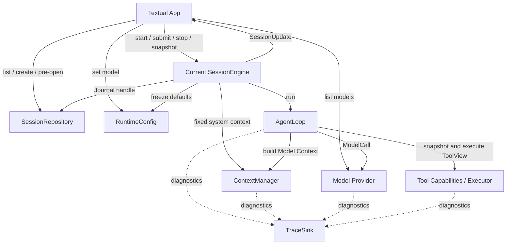

# MiniAgent 总体架构设计

## 1. 文档目的

本文定义 MiniAgent 的目标模块、职责边界和模块间交互。MiniAgent 是一个本地单 UI Agent Runtime：用户可以保存多个相互隔离的 Session，但一个进程同一时刻只运行一个 Current Session。

领域术语以仓库根目录 `CONTEXT.md` 为准。局部设计见：

- `docs/design-docs/main-loop.md`
- `docs/design-docs/tool-registry-and-execution.md`
- `docs/design-docs/openai-compatible-model-provider.md`
- `docs/design-docs/context-management.md`
- `docs/design-docs/persistence-and-observability.md`
- `docs/design-docs/textual-ui.md`

本文描述目标架构。若局部文档或当前代码与本文冲突，应显式记录实现差距，不能静默选择其中一个版本。

## 2. 架构原则

### 2.1 一个活动 Session

一个进程最多有一个活动 `SessionEngine` worker。历史 Session 只是本地持久化记录；用户打开另一个 Session 时，系统先验证目标可打开，再停止当前 Session，绝不让旧 Session 转为后台运行。

切换事务可以短暂同时持有新旧两个 Repository handle，但只有旧 Session 的 worker 能运行。新 worker 必须在旧 worker 停止并释放资源后启动。

### 2.2 排队输入不是恢复事实

`SessionEngine` 接受输入时分配 `message_id` 和 `run_id`，并将其保存为内存 `QueuedInput`。排队输入可以展示和撤回，但不写 Message Journal；切换、关闭或进程崩溃时允许丢失。

worker 真正开始处理队首输入时，必须先将用户消息写入并 fsync Message Journal。只有写入成功后，才能建立 AgentRunEnvironment、调用模型或执行工具。持久化失败不得产生模型费用或工具副作用。

### 2.3 状态所有权

- Textual App 拥有 Current Session 引用、UI Projection 和 Session 生命周期转换；
- SessionEngine 拥有单个 Session 的内存输入队列、Transcript、唯一 worker 和运行取消；
- SessionRepository 拥有目录发现、Journal 读写和 writer lock；
- AgentLoop 拥有一次 AgentRun 的控制状态；
- ContextManager 拥有 system context 与 Model Context 的组装规则；
- RuntimeConfig 拥有当前模型与运行默认值。

模型、工具、UI 和存储实现都不能绕过 SessionEngine 修改 Transcript。Textual App 可以编排应用生命周期，但不执行 AgentLoop，也不解释模型或工具协议。

### 2.4 固定运行环境与动态工具

队首用户消息持久化成功后，SessionEngine 收集已经组装好的固定值，形成不可变 AgentRunEnvironment。system context、model_id、生成选项和运行限制在整个 AgentRun 中保持不变；模型切换只影响尚未开始的排队输入。

ToolView 是唯一按 ModelCall 动态组装的能力快照。AgentLoop 必须使用同一个 ToolView 构建 prompt、声明 schema 并执行 ToolUse。

### 2.5 可替换的外部边界

Textual、模型供应商、工具实现、SessionRepository 和 TraceSink 都是核心循环之外的适配边界。测试可以用内存实现替换它们。

## 3. 总体模块

### 3.1 Textual App

Textual App 是唯一应用入口。它直接组合 SessionRepository、SessionEngine、RuntimeConfig 和 Model Provider，并负责：

- 保持零个或一个 Current Session；
- 首条消息创建 Session；
- 按需列出并切换历史 Session；
- 订阅 SessionUpdate 并维护 UI Projection；
- 选择全局模型；
- 有序清空、切换和关闭。

创建、打开、清空和关闭由一个轻量 `session_transition_lock` 串行化。普通消息提交不占用此锁；生命周期转换开始后 UI 停止接受新输入。

Textual App 不提供统一 `dispatch(ApplicationRequest)`，也不维护自定义可靠 UI Update 队列、事件 cursor、缺口补放或自动全量重同步协议。

### 3.2 SessionEngine

SessionEngine 是 Current Session 的运行边界和 Transcript 的唯一提交者。它负责：

- 接受输入、校验并分配 `message_id` 与 `run_id`；
- 用 FIFO 内存队列保存 QueuedInput；
- 通过唯一 `serve()` worker 串行执行 AgentRun；
- 在运行开始前持久化用户消息；
- 接受完整 AssistantMessage、ToolResult 和 AgentRun 终态；
- 发布单一 SessionUpdate 流；
- 取消活动运行、丢弃排队输入并停止 worker。

SessionEngine 不维护 Run Segment。后续输入只有在前一个 AgentRun 已终止后才会写入 Journal，因此 Journal 物理顺序天然等于对话因果顺序。

### 3.3 SessionRepository

SessionRepository 是本地 Session 存储的唯一入口。它提供按需 `list_sessions()`、新建 Journal 和 `open_session()`。打开成功的 handle 持有该 Session 的独占 writer lock，并在关闭时释放。

Repository 不维护 `session.json` 或目录缓存。Session 名称由第一条用户消息生成且不可重命名；创建时间、最后用户输入时间和可打开状态都从 Message Journal 派生。列表扫描隔离单个损坏目录，保留不可打开条目而不是静默隐藏。

打开 Session 时完整验证并重放 Journal，不实现历史分页、cursor 或增量恢复协议。

### 3.4 AgentLoop

AgentLoop 承载一条已持久化用户消息触发的一次 AgentRun。它接收固定 AgentRunEnvironment 和只读 Working Context，并在每次 ModelCall 前取得最新 ToolView、构建 Model Context、调用模型、执行工具，最后返回明确 AgentRunResult。

AgentLoop 通过窄接口向 SessionEngine 提交结果：完整 AssistantMessage、ToolResult 和终态。流式 delta 只发布为 SessionUpdate 或 Trace，不进入 Message Journal。

### 3.5 ContextManager

ContextManager 在 AgentRun 开始时组装固定 system context，并在每次 ModelCall 前根据 AgentRunEnvironment、Working Context 和 ToolView 动态构建 Model Context。压缩只改变模型输入投影，不删除或改写 Transcript。

### 3.6 Model Provider 与 RuntimeConfig

Model Provider 隔离认证、HTTP/SSE、请求转换和供应商错误。RuntimeConfig 独立保存当前 model_id 与运行默认值。Textual App 直接调用 RuntimeConfig 切换模型；活动 AgentRun 使用已经冻结的 model_id，内存排队输入在真正开始时读取新值。

模型列表不做应用级缓存，用户打开模型选择器时按需查询 Provider。

### 3.7 Tools

工具模块提供 ToolView，其中同时绑定可见 ToolSpec、schema、权限和执行能力。AgentLoop 不依赖具体工具实现。

### 3.8 Persistence、SessionUpdate 与 Trace

Message Journal 只保存恢复所需的完整记录：用户消息、完整 AssistantMessage、ToolResult、ContextSummary 和 RunTerminated。它不保存排队输入、Assistant started、流式 delta 或通用事件信封。

Journal 的物理行顺序就是事实顺序，不保存 `journal_sequence`。每类记录使用自己的自然身份，不增加通用 `event_id`，持久化失败后不自动猜测并重试追加。

SessionUpdate 是当前进程面向 UI 的单一通知流，可以包含排队状态、流式草稿、完整消息和运行状态，但不参与恢复。Trace 是可丢失的诊断数据，也不参与业务恢复。

## 4. 核心流程

### 4.1 首条输入

应用启动或 `/clear` 后没有 Current Session。首条输入走专用路径：

1. Textual App 在生命周期锁内构造未启动的 SessionEngine；
2. `SessionEngine.start(first_text)` 校验输入并分配 message_id、run_id；
3. Repository 创建目录、writer lock 和 Journal，并持久化用户消息；
4. 成功后 Textual App 设置 Current Session 并展示消息；
5. worker 冻结 AgentRunEnvironment 并启动 AgentLoop。

任一步失败都不设置 Current Session，也不调用模型。

### 4.2 后续输入与排队

运行期间 `submit(text)` 保持可用：

1. SessionEngine 校验输入并分配 message_id、run_id；
2. 创建仅存在内存的 QueuedInput；
3. 发布 `InputQueued`，UI 显示“排队中”；
4. 用户可以按 message_id 撤回，不能编辑或重排；
5. worker 出队时先持久化原身份的用户消息；
6. 持久化成功后发布 `InputCommitted`，冻结运行环境并执行 AgentRun。

排队项使用执行开始时的全局模型，而不是入队时的模型。

### 4.3 切换 Session

用户选择另一个 Session 即授权停止当前运行和丢弃全部排队输入，不再二次确认：

1. Textual App 获取生命周期锁并禁止新提交；
2. Repository 预打开目标 Session、获取 writer lock并完整恢复；
3. 预打开失败时保持当前 Session 原样运行；
4. 预打开成功后调用当前 `SessionEngine.stop(SESSION_SWITCHED)`；
5. 取消活动 AgentRun并提交终态，丢弃未持久化队列，释放旧 handle；
6. 为目标启动唯一 worker，以完整 snapshot 替换 UI Projection。

`/clear` 与 Session picker 中的 `New session` 复用同一流程，但目标是“无 Current Session”的空白状态，不立即创建目录。

### 4.4 恢复

历史列表只在用户打开 Session picker 时扫描。选择目标后 Repository 获取 writer lock，完整验证并重放 Journal。

若发现已持久化用户消息对应的 AgentRun 没有终态，SessionEngine 不重放模型或工具；它忽略未完成的内存草稿，并追加 `PROCESS_INTERRUPTED`。由于 QueuedInput 从不持久化，恢复时不存在待续跑队列。

### 4.5 关闭

Textual App 停止接收输入并调用 `SessionEngine.stop(APPLICATION_SHUTDOWN)`。Engine 丢弃排队输入、协作取消活动运行、提交终态、drain Journal 并释放 writer lock。超时退出的未完成 Run 在下次恢复时记为 `PROCESS_INTERRUPTED`。

## 5. 错误边界

- 用户消息持久化失败：不进入 Transcript，不启动 AgentRun；
- Assistant、ToolResult 或终态持久化失败：停止当前运行并要求重新打开 Session 验证 Journal；
- Provider 和上下文失败：由 AgentLoop 转换为明确 AgentRunResult；
- 工具的预期失败：形成 ToolResult，模型可以继续；
- SessionUpdate 投递失败：不回滚 Journal 或改变 AgentRun；
- Trace 写入失败：不改变业务结果；
- 目标 Session 损坏或被锁：切换前失败，当前 Session 保持不变。

## 6. 核心不变量

1. 一个进程最多有一个活动 SessionEngine worker。
2. SessionEngine 是 Transcript 的唯一提交边界。
3. QueuedInput 只存在内存，不属于恢复事实。
4. 任何模型或工具动作发生前，触发该 AgentRun 的用户消息必须已经 fsync。
5. 同一 Session 的 AgentRun 严格串行；下一条用户消息只在上一 Run 终止后写入 Journal。
6. Journal 物理顺序就是 Transcript 的事实顺序。
7. AgentRunEnvironment 在 AgentRun 内保持不变；每个 ModelCall 使用最新且一致的 ToolView。
8. 未完成 Assistant 草稿不进入 Journal 或后续 Model Context。
9. Transcript 不因压缩、UI 行为或切换而删除或改写。
10. 恢复不得自动重放模型调用或可能有副作用的工具调用。
11. 同一个 Session 同时只有一个进程持有 writer lock。
12. SessionUpdate 和 Trace 都不参与业务恢复。

## 7. 验证场景

1. 空白启动后首条消息成功创建 Session；创建失败时不调用模型。
2. 运行期间连续提交消息会获得身份、显示排队态，并按 FIFO 串行执行。
3. 排队项未出队前不出现在 Journal，撤回、切换和关闭会丢弃它。
4. 出队用户消息 fsync 成功后才启动 AgentRun。
5. 模型切换不影响活动 Run，但影响尚未开始的排队输入。
6. 切换先验证目标；目标损坏或被锁时不取消当前 Run。
7. 成功切换会取消当前 Run、丢弃队列，并且始终只有一个 worker。
8. 打开历史 Session 完整恢复；未完成 Run 记为 PROCESS_INTERRUPTED 且不重放工具。
9. 损坏 Session 在列表中可见但不可打开，不影响其他条目。
10. UI 更新丢失和 Trace 失败不改变 Journal 或 AgentRunResult。
11. 两个进程竞争同一 Session 时只有一个获得 writer lock。

## 8. 当前实现差距

当前代码已经具备 SessionEngine、AgentLoop、ContextBuilder、OpenAI-compatible Model Adapter、ToolRegistry、ToolExecutor 和 JsonlTranscriptStore 的基础实现，但尚未达到本文边界：

- AgentLoop 当前仍负责提交用户消息；目标是由 SessionEngine 在 AgentRun 开始前提交。
- SessionEngine 当前只有简单 asyncio.Queue，没有 `start/serve/stop` 生命周期和排队项撤回语义。
- 当前所有 SessionEvent 都使用通用 `emit()`、event_id 和 sequence，并持久化 Assistant started/delta/discard；目标 Journal 只保存完整恢复事实。
- 当前 AssistantMessage 依赖 started/completed 草稿配对；目标是草稿仅存在内存，完成时一次提交。
- JsonlTranscriptStore 当前没有恢复扫描、fsync、writer lock、目录列表和损坏隔离。
- Textual App、SessionUpdate、按需历史列表和 Session 切换尚未实现。
- AgentLoop 尚未接收 AgentRunEnvironment，也未在每次 ModelCall 前获取 ToolView。
- 当前 ContextBuilder 尚未完整实现 ContextManager 的动态组装与压缩生命周期。

这些差距表示后续实现工作，不否定已有代码和测试。
