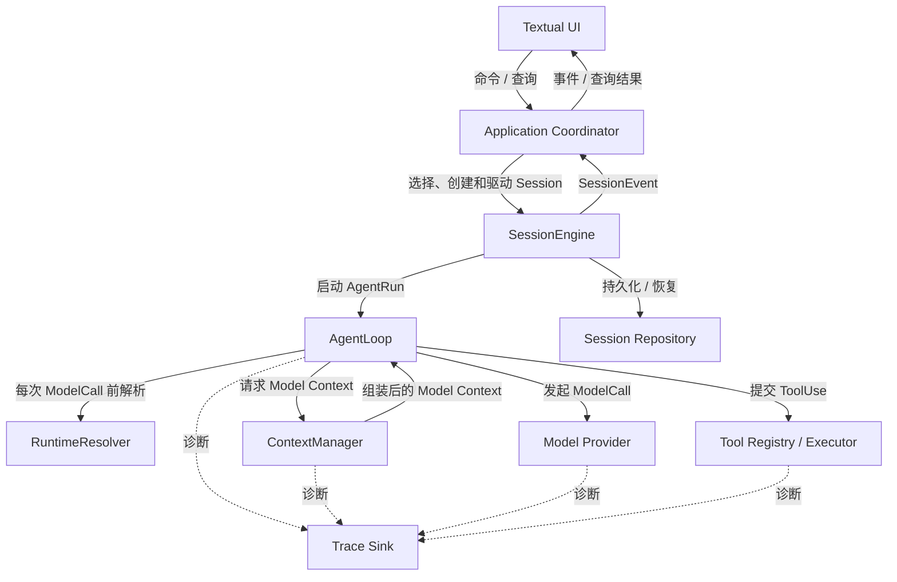
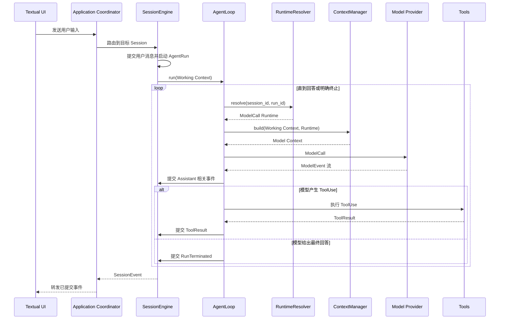

# MiniAgent 总体架构设计

## 1. 文档目的

本文定义 MiniAgent 的总体模块、职责边界和模块间交互。它是系统级设计入口，回答“系统由哪些模块组成”和“模块如何协作”，不展开工具内部执行策略、模型供应商协议、Textual UI 布局或具体存储格式。

MiniAgent 的目标是从零实现一个最小可用 Agent Runtime：用户可以在多个相互隔离的 Session 中持续对话；模型可以直接回答或请求工具；上下文能够延续、动态组装并在接近窗口上限时压缩；运行过程可以恢复、追踪和测试。

领域术语以仓库根目录 `CONTEXT.md` 为准。主循环、工具和模型供应商的局部设计分别见：

- `docs/design-docs/main-loop.md`
- `docs/design-docs/tool-registry-and-execution.md`
- `docs/design-docs/openai-compatible-model-provider.md`

本文描述目标架构。若局部文档或当前代码与本文冲突，应先显式记录差异并协调设计，不能静默选择其中一个版本。

## 2. 架构原则

### 2.1 控制与信息流

模块间遵循三种交互方式：

- 命令向下传递，表达用户或上层模块希望系统执行的动作；
- 事件向上传递，表达已经被系统接受的事实；
- 查询读取投影，不借查询修改运行状态。

SessionEvent 必须先由 SessionEngine 接受并持久化，才能更新内存投影并作为正式状态通知 UI。UI 投递失败不反向破坏已经提交的 AgentRun 状态。

### 2.2 状态所有权

每类状态只有一个所有者：Application Coordinator 拥有应用级多 Session 目录；SessionEngine 拥有单个 Session 的事件顺序和消息投影；AgentLoop 拥有一次 AgentRun 的控制状态；ContextManager 拥有一次 ModelCall 的上下文组装过程。

上下文压缩只改变模型输入投影，不删除或改写 Transcript。模型、工具、UI 和存储适配器都不能绕过 SessionEngine 直接修改会话历史。

### 2.3 动态运行环境

Agent 的可用模型、工具、权限、上下文预算或其他运行能力可能随时改变，因此 SessionEngine 不长期持有一次解析后的运行能力。AgentLoop 在每次 ModelCall 前通过 RuntimeResolver 获取当时有效的 ModelCall Runtime。

一次已经发出的 ModelCall 使用调用开始时解析出的运行环境。调用期间发生的变化不修改在途请求，但会在后续外部动作和下一次 ModelCall 生效。

### 2.4 可替换的外部边界

Textual UI、模型供应商和持久化实现都是核心 Runtime 之外的适配边界。核心流程不依赖 Textual Widget、OpenAI 原始 JSON、HTTP/SSE 或具体数据库格式。测试可以用内存实现替换这些边界。

## 3. 总体模块



RuntimeResolver 是应用运行层中的协作边界，不要求成为独立部署单元或大型模块。它的存在是为了确保 AgentLoop 每次发起 ModelCall 时读取最新状态，而不是复用长期缓存的运行能力。

### 3.1 Application Coordinator

Application Coordinator 是应用的顶层控制者，负责管理多个 Session、路由用户命令、回答应用级查询，并将 SessionEvent 转发给 UI。它不执行 Agent 循环，不组装模型上下文，也不解释模型或工具协议。

Textual UI 只能通过 Application Coordinator 与 Runtime 交互。切换当前显示的 Session 不会取消其他 Session 的后台运行。

### 3.2 SessionEngine

SessionEngine 是单个 Session 的所有者，也是 Transcript 和消息投影的唯一提交边界。它负责接收用户输入、维护输入队列、确保同一 Session 内 AgentRun 串行执行、启动和结束 AgentRun、分配事件顺序、恢复历史以及处理取消。

SessionEngine 长期持有会话身份、事件与消息投影、队列和当前运行标识。它不长期持有某次 ModelCall 解析出的 Model Provider、工具视图或 Context 配置。

### 3.3 AgentLoop

AgentLoop 承载由一条用户输入触发的一次 AgentRun。它是确定性状态机：请求运行环境、请求上下文、调用模型、消费规范化模型输出、在需要时调用工具，并根据模型结果、取消、错误和轮次限制决定继续或终止。

模型负责通过结构化输出提出直接回答或工具调用意图；AgentLoop 不自行推测模型意图。一次 AgentRun 可以包含多次 ModelCall，`turn_count` 只统计实际发出的 ModelCall。

### 3.4 RuntimeResolver

RuntimeResolver 在每次 ModelCall 前读取最新 Agent 状态，解析该调用所需的 ModelCall Runtime。该运行环境可以包含当前 Model Provider、可见工具集合、上下文窗口和运行限制等能力与约束。

RuntimeResolver 只解析当前状态，不拥有 Session 历史，也不驱动 AgentLoop。其返回值是单次 ModelCall 使用的不可变视图，用完即失效。

### 3.5 ContextManager

ContextManager 负责每次 ModelCall 的动态上下文组装。AgentLoop 将当前 Session 的 Working Context 和 ModelCall Runtime 交给 ContextManager；ContextManager 选择有效消息、注入系统信息、处理工具结果、排除无效内容、估算预算并在必要时压缩，最后返回完整的 Model Context。

ContextManager 不主动调用 AgentLoop。交互必须保持为“AgentLoop 请求，ContextManager 返回”，从而避免循环依赖。

ContextManager 使用三层上下文模型：

```text
Transcript          完整、追加式的权威会话事实
    ↓ 投影
Working Context     已被 SessionEngine 接受的有效消息
    ↓ 动态组装
Model Context       单次 ModelCall 实际发送给模型的输入
```

思考过程可以作为 Session 记录或 Trace 保留，但默认不重新放入后续 Model Context。用户消息、Assistant 最终文本、ToolUse 和必要的 ToolResult 构成可延续对话的主要内容。

当预计输入达到模型上下文窗口的 80% 时，ContextManager 执行确定性压缩，目标是将输入降至窗口的 50% 以下。压缩覆盖完整的旧交互，并用带消息边界的 ContextSummary 替代；它不能从任意字符位置截断 ToolUse 与 ToolResult 的关系。压缩开始、完成或失败通过 SessionEvent 表达，供 UI 告知用户，但压缩不计入 `turn_count`。

### 3.6 Model Provider

Model Provider 隔离外部模型协议。它接收 Model Context、当次调用可用的工具 Schema 和生成选项，并输出规范化的文本、思考、工具调用增量和终态事件。

Provider 负责认证、请求转换、HTTP/SSE 和供应商错误规范化；AgentLoop 负责 AssistantMessage 的组装和循环控制。Provider 不访问 Session，不执行工具，也不决定 AgentRun 是否继续。

### 3.7 Tools

工具模块由 ToolRegistry 和 ToolExecutor 两个逻辑职责构成。Registry 提供工具名称、描述和参数 Schema；Executor 接收 ToolUse 并返回结构化 ToolResult。AgentLoop 只依赖这项输入输出契约，不了解 calculator、search、todo 等具体工具的实现。

本文不规定工具内部的权限模型、并发策略、重试算法或具体工具设计，这些内容由工具模块局部设计负责。

### 3.8 Persistence and Observability

Session Repository 保存 Session 元数据、追加式 Transcript 和 ContextSummary 检查点，并支持 SessionEngine 恢复投影。Transcript 是恢复的权威来源；ContextSummary 是可重建的派生检查点。

SessionEvent 与 Trace 必须区分。SessionEvent 是可重放的产品事实，用于持久化、恢复和 UI 投影；Trace 是诊断数据，用于记录耗时、重试、内部错误和关联 ID，不参与业务状态恢复。

持久化成功先于内存提交和 UI 正式展示。进程恢复时，不自动重放结果未知或可能有副作用的外部动作；未完成草稿应被作废，并以明确的中断原因结束原 AgentRun。

### 3.9 Textual UI

Textual UI 是输入输出适配器。它向 Application Coordinator 发送命令和查询，并消费 SessionEvent。UI 不直接依赖 AgentLoop、ContextManager、Model Provider、工具或 Session Repository，也不拥有权威会话状态。

本文不定义 UI 布局、Widget、快捷键或展示细节。

## 4. 核心运行流程

### 4.1 用户输入到最终回答



每次进入循环都会重新解析 ModelCall Runtime 并重新构建 Model Context。AgentLoop 可以在内存中维护本次 AgentRun 已经被 SessionEngine 接受的 Working Context，但不能把未提交的草稿或结果送入下一次 ModelCall。

### 4.2 多 Session 与排队

同一 Session 同一时刻最多有一个活动 AgentRun。运行期间到达的新用户输入进入该 Session 的队列；取消必须由显式命令触发。不同 Session 可以并发运行，互不共享消息、队列和有状态数据。

```text
Session A: AgentRun A1 → queued A2 → AgentRun A2
Session B: AgentRun B1 ─────────────────────────→
```

### 4.3 上下文自动压缩

每次 ModelCall 前，ContextManager 使用 ModelCall Runtime 中的窗口与输出预留计算输入预算：

```text
预计输入 < 80%  → 直接返回 Model Context
预计输入 ≥ 80%  → 提交压缩开始事件
                 → 确定性压缩至 ≤ 50%
                 → 保存 ContextSummary
                 → 提交压缩完成事件
                 → 返回 Model Context
```

如果压缩失败，原 Transcript 和已提交投影保持不变，当前 AgentRun 产生明确的失败终态。服务端仍返回输入过长时，可以按主循环局部设计执行一次强制压缩重试，但不能无限重试。

### 4.4 恢复流程

Application Coordinator 从 Session Repository 查询可恢复的 Session。SessionEngine 按 Transcript 顺序重建消息和运行投影。若发现上次进程留下未完成 AgentRun，则作废未完成 Assistant 草稿，记录进程中断终态，并等待新的用户输入；系统不能根据旧 ToolUse 猜测并重新执行外部动作。

## 5. 错误边界

错误按责任范围传播：

- 可由模型理解和修正的工具失败形成 ToolResult，AgentLoop 可以继续；
- Provider 的规范化失败由 AgentLoop 根据类别和限制决定重试或终止；
- ContextManager 压缩失败终止当前 AgentRun，不修改既有历史；
- Session Repository 写入失败意味着事件未提交，禁止进入正式投影；
- UI 投递失败只影响展示，可以通过事件序号补发，不改变 AgentRun；
- 取消是明确的停止原因，不作为未分类异常处理。

所有 AgentRun 都必须产生明确终态。原始异常和堆栈只进入经过脱敏的 Trace，不直接暴露给模型或 UI。

## 6. 测试策略

测试以完整运行场景为主，模块规则测试为辅。场景测试使用 Fake Model Provider、内存 Session Repository 和可控工具，从 Application Coordinator 或 SessionEngine 边界驱动系统，并断言 SessionEvent、最终消息和 Session 隔离。

总体架构至少需要以下可观察场景：

1. 模型直接回答并正常结束。
2. 模型调用工具后根据 ToolResult 返回最终答案。
3. 达到最大 ModelCall 次数后以明确原因终止。
4. 纯对话追问和带工具追问都能使用已提交历史。
5. 两个 Session 可并行运行且状态互不影响。
6. 输入达到 80% 后产生压缩事件并降至 50% 以下。
7. Provider、上下文和持久化失败遵守各自错误边界。
8. 取消和进程中断后能够恢复，不重放未知外部动作。
9. 每次 ModelCall 都重新调用 RuntimeResolver，并使用最新运行环境组装上下文。

模块级测试重点验证 AgentLoop 状态转换、SessionEngine 事件投影、ContextManager 预算与摘要边界，以及 Model Provider 的规范化契约。Textual UI 不承担核心 Runtime 正确性，只需验证它遵守命令、查询和事件边界。

## 7. 核心不变量

1. SessionEngine 是 SessionEvent 和有效消息历史的唯一提交边界。
2. 未被 SessionEngine 接受的模型草稿或工具结果不能进入 Working Context。
3. AgentLoop 每次 ModelCall 前都通过 RuntimeResolver 获取最新 ModelCall Runtime。
4. ContextManager 每次 ModelCall 都动态组装 Model Context，并将结果返回 AgentLoop。
5. Transcript 不因上下文压缩、裁剪或 UI 行为而删除或改写。
6. 达到 80% 窗口水位时触发确定性压缩，正常目标为 50% 以下。
7. 同一 Session 的 AgentRun 串行执行，不同 Session 可以并行。
8. Model Provider 和 ToolExecutor 不直接修改 Session 状态。
9. UI 不直接驱动 AgentLoop，也不拥有权威会话历史。
10. SessionEvent 用于业务恢复，Trace 不参与业务投影。

## 8. 当前实现差距

本文是后续实现的目标边界。当前仓库已经具备 SessionEngine、AgentLoop、ContextBuilder、OpenAI-compatible Model Adapter、ToolRegistry、ToolExecutor 和 TranscriptStore 的基础实现，但仍存在以下架构差距：

- AgentLoop 当前在构造时长期接收固定的 ModelAdapter、ContextBuilder、ToolExecutor 和工具集合，尚未在每次 ModelCall 前通过 RuntimeResolver 动态解析运行环境。
- 当前名称为 ContextBuilder，职责尚未完整覆盖本文定义的 ContextManager 动态组装、80% 触发、50% 目标及压缩生命周期事件。
- SessionEngine 当前可以追加 Transcript，但 Session 元数据目录、完整加载恢复和 ContextSummary 检查点尚未形成统一 Session Repository。
- Application Coordinator 和 Textual UI 适配边界尚未实现。
- 现有局部设计文档中的固定配置或构造期依赖描述，需要在对应模块演进时与本文对齐。

这些差距表示待实现工作，不否定已有模块和测试。后续改动应按可验证的增量逐步收敛到本文定义的边界。
