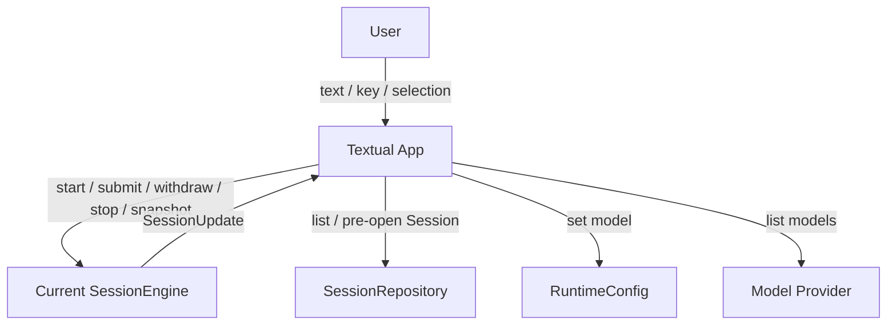

# Textual UI 模块设计

## 1. 文档目的

本文定义 MiniAgent 的 Textual 终端 UI，包括应用生命周期编排、布局、输入与 slash command、消息投影、流式渲染、虚拟滚动、Session 切换、取消与退出语义。

MiniAgent 是本地单 UI 应用。Textual App 可以保存和打开多个历史 Session，但同一时刻只拥有一个 Current Session，并且全进程最多运行一个 SessionEngine worker。

## 2. 目标与非目标

### 2.1 目标

- 展示用户消息、模型文本、reasoning 和用户可读工具摘要；
- AgentRun 期间继续接受输入并展示明确的排队状态；
- 直接编排 Current Session 的创建、切换、清空和关闭；
- 消费 Session snapshot 与单一 SessionUpdate 流；
- 展示并裁决 Current Session 的 pending Permission Request；
- 长历史完整加载到 UI Projection，但只渲染可见行；
- 切换 Session 前验证目标，再自动停止当前 Session；
- 展示语言以用户任务为中心，不暴露 Journal 或供应商协议。

### 2.2 非目标

- 不运行 AgentLoop，不解析模型或工具协议；
- 不拥有 Transcript 或 Message Journal；
- 不支持后台 Session、未读通知或多 Session 并发；
- 不实现统一 ApplicationRequest dispatch；
- 不实现可靠 UI 消息总线、revision、cursor、补放或自动缺口重同步；
- 不实现历史消息分页；
- 不在 UI 中提供 Trace、token 或 turn 调试面板。

## 3. 边界与状态所有权



Textual App 拥有：

- Current Session 引用或“无 Current Session”状态；
- 一个只用于创建、切换、清空和关闭的 `session_transition_lock`；
- 当前聊天的 UI Projection；
- viewport、展开状态、Composer 文本、modal 和布局缓存；
- 模型与 Session 选择流程。
- Permission Prompt 的临时展示状态；正式 pending request 和许可缓存仍由 SessionEngine 拥有。

Textual App 不拥有：

- Transcript、Journal record、QueuedInput FIFO 或 AgentRun 控制状态；
- ToolUse、ToolResult 或 AssistantMessage 的有效性判断；
- Model Context、Provider 请求或工具执行。

SessionEngine 的 Journal 提交失败不能被 UI Update 掩盖。展示性 SessionUpdate 投递失败不回滚 Session 事实；用户重新打开 Session 时，从完整 snapshot 重建 UI Projection。Permission Request 是例外的可操作内存状态：SessionEngine 把 pending request 保留在 snapshot 中并至少通知一次，UI 只负责提交 Permission Decision。

## 4. Current Session 与生命周期

### 4.1 空白启动

应用启动时不扫描历史目录，也不创建临时 Session。主界面处于无 Current Session 的空白状态。

第一条普通输入触发：

```python
await SessionEngine.start(first_text)
```

只有 Session 目录、writer lock 和首条 UserMessage 都创建成功后，Textual App 才设置 Current Session、清空 Composer 并展示正式用户消息。失败时保留输入并显示可读错误。

### 4.2 Session 生命周期锁

以下操作必须在同一个 lifecycle lock 内串行：

- 首条消息创建 Session；
- 打开历史 Session；
- `/clear` 或 `New session`；
- 应用关闭。

普通 `submit()` 不持有该锁。生命周期转换开始后 UI 立即禁止新提交；已经进入 SessionEngine 的操作由 Engine 完成或拒绝。

### 4.3 打开历史 Session

历史 Session 只在用户打开选择器时按需扫描。选择目标后：

1. Repository 预打开目标、获取 writer lock并完整恢复；
2. 失败时关闭 modal并显示错误，Current Session 保持运行；
3. 成功后调用当前 `SessionEngine.stop(SESSION_SWITCHED)`；
4. 旧 Engine 取消活动 Run、丢弃排队输入并释放旧 lock；
   pending Permission Request 和全部 Session Permission Grant 同时清除；
5. 为目标启动唯一 worker；
6. 用目标 snapshot 替换 UI Projection并定位到底部。

用户选择 Session 即授权停止当前运行和丢弃排队输入，不弹出二次确认。切换入口必须用简短文案说明该结果。

### 4.4 清空与新 Session

`/clear` 和 SessionPicker 中的 `New session` 调用同一个操作：停止 Current Session、丢弃队列、释放 lock、清空 UI Projection并回到空白状态。它们不立即创建目录；下一条普通输入才创建新 Session。

## 5. UI Projection 与 SessionUpdate

UI Projection 是 snapshot 和 SessionUpdate 的非权威派生视图：

```python
dirty_ids = projection.apply(update)
```

最小消息状态包括：

```text
UiMessage
  message_id
  role
  ordered parts
  lifecycle: queued | draft | completed | failed
```

snapshot 还包含 TodoStore 为 Current Session 返回的结构化 `TodoList`，并可以包含至多一个 `PendingPermission`。两者都不属于 UiMessage 或 Transcript。`PermissionRequested` 只通知 UI 重新读取或应用当前 permission 状态；关闭、裁决、取消或 stop 后 pending 状态消失。

典型更新包括 InputQueued、InputWithdrawn、InputCommitted、AssistantStarted、AssistantDelta、AssistantDiscarded、AssistantCompleted、ToolResultCompleted、TodosChanged、PermissionRequested、RunTerminated、QueueDiscarded 和 SessionStopped。

UI 不接收 Journal sequence、event_id、恢复 cursor 或投影 revision。message_id、part_id 和 tool_use_id 可以作为投影关联键，但不向用户展示。

流式和普通展示 SessionUpdate 允许合并或丢失。第一版不检测通用事件缺口；明确打开或重新打开 Session 时以完整 snapshot 为准。需要用户操作的 Permission Request 不是瞬时事件：SessionEngine 必须保留在 snapshot 并至少投递一次 `PermissionRequested`，因此 UI 不需要 revision、cursor 或历史补放。

`TodosChanged` 携带完整不可变 TodoList，UI 按列表原顺序替换任务投影，不解析 `todo_write` 的 content 或 Tool Presentation。更新丢失时，下次明确 snapshot 从应用级 TodoStore 重建。同一进程重开 Session 可以恢复其列表；应用重启后列表为空，即使 Transcript 中存在历史 `todo_write` ToolResult 也不回放。

## 6. 主界面布局

主界面使用连续文档流，不使用左右聊天气泡或整条消息卡片：

```text
┌──────────────────────────────────────────────────────┐
│  You                                                 │
│  用户消息                                            │
│  queued                                              │
│                                                      │
│  MiniAgent                                           │
│  ▸ reasoning 原文开头片段…                           │
│  Assistant Markdown 内容                             │
│  ▸ Read 42 lines from miniagent/session.py           │
│                                      ↓ new content   │
├──────────────────────────────────────────────────────┤
│ cwd  ·  session title  ·  model          ⠋ 运行中 │
├──────────────────────────────────────────────────────┤
│ 多行输入框                                           │
└──────────────────────────────────────────────────────┘
```

状态栏左段显示只读 cwd、Current Session 标题或空白状态、当前模型名称；右段显示运行态——运行中（braille 字符 spinner）、`排队 n`、`✗ 出错`，无活动时留空。它不展示内部 turn、token、ToolView 版本或 Journal 信息。

用户消息提交后立即显示；消息区不显示 spinner，运行态由状态栏右段表达。

## 7. Textual 组件边界

```text
MiniAgentApp
└── ChatScreen
    ├── MessageViewport : ScrollView
    ├── NewContentButton
    ├── SlashCompletionOverlay
    ├── StatusBar
    └── Composer

ModalScreen
├── ModelPickerModal
├── SessionPickerModal
└── PermissionPromptModal
```

`MiniAgentApp` 组合 Repository、RuntimeConfig、Model Provider 和 Current SessionEngine，执行本文件定义的生命周期流程。它不得直接执行 AgentLoop 或工具。

`MessageViewport` 使用虚拟行渲染，只为可见区和 overscan 生成 Strip。`Composer` 只保存未提交文本和产生 UI action，不直接创建领域 Message。

TodoList 的具体视觉组件可以按主题调整，但只消费 `id`、`content` 和 `status`：pending、in_progress、completed 必须可区分，最多一个 in_progress 作为当前焦点。UI 不修改、排序或补全列表，也不把前端交互反向写入 TodoStore。

Modal 建立 focus trap，关闭后焦点回到 Composer。Slash completion overlay 不参与正常布局。

## 8. 输入、排队和撤回

### 8.1 普通输入

Current Session 存在时，Composer 提交调用：

```python
queued = await session.submit(text)
```

SessionEngine 成功接收后返回已经分配的 message_id 和 run_id，并发布 InputQueued。UI 清空 Composer，将消息显示为 `queued`。QueuedInput 不等于已持久化 UserMessage。

worker 开始处理该项并成功持久化后发布 InputCommitted；UI 将同一 message_id 从 queued 转为正式用户消息。持久化失败时显示 failed，并阻止后续队列自动执行。

### 8.2 撤回

queued 消息提供按 message_id 撤回的操作。撤回成功后从 UI Projection 移除。已经出队或持久化的消息不能撤回、编辑或重排。

### 8.3 模型选择

排队输入不绑定入队时模型。用户切换模型后，当前 AgentRun 不变；每条 QueuedInput 在真正出队并开始运行时冻结当时的 RuntimeConfig。

## 9. 消息与 Part 展示

AssistantMessage 的 TextPart、ReasoningPart 和 ToolUsePart 必须保持原始顺序。UI 不把所有 Parts 拼成一个大字符串。

### 9.1 流式 Markdown

普通文本在流式期间渲染 Markdown。渲染器缓存已闭合 block，只重新解析末尾未完成 block；Assistant 完成后冻结相应缓存。宽度或展开状态变化时只使必要项失效。

### 9.2 Reasoning

存在的 reasoning 必须可展开查看。折叠态直接取原始内容开头的第一个非空片段并按一行截断，不调用模型总结。来源解析属于 ModelAdapter 后的消息处理层，不放进 Textual widget。

### 9.3 工具展示

ToolUse 和 ToolResult 通过 tool_use_id 在投影中关联，但 UI 不显示该 ID。一个 AssistantMessage 中的多个工具展示按原 ToolUse 顺序排列，完成顺序不改变布局。

`ToolPresentationRegistry` 把工具事实转换为用户可读摘要与正文。未注册工具使用安全回退文案，不能直接打印原始参数 JSON；敏感字段在进入展示前过滤。

### 9.4 运行终态

内部枚举和异常不能原样展示。正常完成不增加状态项；取消、模型不可用、上下文过长、达到限制和持久化失败使用简短可读文案。Trace 和堆栈不进入消息区。

### 9.5 Permission Prompt

当 snapshot 或 `PermissionRequested` 表明存在 pending request 时，UI 打开唯一 PermissionPromptModal。一个 ToolUse 的全部未授权越界目标整体展示并整体裁决；每项目标显示用户可读工具名、read/write/delete、exact/subtree 和解析后的绝对目标，原始路径与实际目标不同时同时显示两者。UI 不展示原始 arguments、tool_use_id、reasoning 或由模型生成的授权理由。

可选决策固定为拒绝、仅此次同意和当前 Session 同意。Escape 或关闭 modal 等同拒绝；Ctrl+C 仍按应用级规则取消整个 AgentRun。Permission Prompt 不自动超时并遵守既有 modal focus trap。UI 把 decision 交给 `SessionEngine.resolve_permission()` 后立即关闭 modal；它不自行更新授权缓存或构造 ToolResult。

## 10. 完整虚拟滚动

打开 Session 时，Runtime 一次提供完整 snapshot；UI 不请求历史分页。

`MessageViewport` 仍使用 VirtualLayoutIndex 和 MessageRenderCache，使屏幕外消息不创建 widget、不参与逐帧渲染。索引至少支持按消息高度更新、前缀高度查询、按 scroll_y 定位和追加消息。

消息高度会因流式增长、Markdown 换行、终端宽度和展开状态变化。UI 使用 message_id 与消息内行偏移保持滚动锚点；用户离开底部后新内容不拉动视口，并显示紧凑的返回底部入口。

终端 resize 先重排可见区与 overscan，再在空闲时修正其他消息高度，不同步重算完整历史。

## 11. 快捷键与 slash command

| 输入 | 行为 |
| --- | --- |
| `Enter` | 提交普通消息或执行已识别命令 |
| `Ctrl+Enter` | 插入换行 |
| `Tab` | 补全 slash command |
| `Escape` | 关闭补全或 modal |
| `End` / `Ctrl+End` | 返回最新消息 |

`Ctrl+C` 优先级：

1. PermissionPromptModal 打开时取消整个活动 AgentRun；
2. Composer 有文本时清空输入；
3. Current Session 有活动 Run 时取消该 Run；
4. 无活动 Run 时首次提示再次按下退出；
5. 1.5 秒内再次按下则有序退出。

公开命令固定为：

| 命令 | 行为 |
| --- | --- |
| `/model` | 按需获取模型列表并打开选择器 |
| `/session` | 按需扫描历史 Session 并打开选择器 |
| `/clear` | 停止 Current Session 并回到空白状态 |
| `/quit` | 有序退出 |

只有输入首 token 精确匹配时才识别命令；未知斜杠文本按普通用户消息提交。

## 12. Modal

ModelPickerModal 打开时直接调用 Provider 列出模型，不使用应用级缓存。失败时显示错误并保留当前模型。选择成功后通过 RuntimeConfig 原子回写配置；活动 Run 不受影响。

SessionPickerModal 显示标题、最近更新时间和可打开状态。损坏 Session 保留在列表中但不可确认。选择 Current Session 不执行切换；选择其他 Session 使用第 4.3 节流程。

PermissionPromptModal 只消费 SessionEngine 已经规范化的展示数据并返回 Permission Decision。它不重新解析路径、不决定目标是否位于 Workspace Root，也不持有 Session Permission Grant。

## 13. 退出

`/quit` 与双击 `Ctrl+C` 进入相同流程：

1. 获取 lifecycle lock；
2. 停止新输入和命令；
3. 调用 `SessionEngine.stop(APPLICATION_SHUTDOWN)`；
4. 丢弃 QueuedInput，协作取消活动 Run并提交终态；
5. drain Journal、释放 writer lock；
6. 超时则退出，后续恢复补记 PROCESS_INTERRUPTED。

## 14. 建议包结构

```text
miniagent/ui/
  app.py                    Textual App 与 Session 生命周期
  screen.py                 ChatScreen
  projection.py             snapshot / SessionUpdate reducer
  commands.py               slash command 定义、匹配和补全
  composer.py               多行输入与快捷键
  status_bar.py             cwd、Session、模型
  viewport.py               行级虚拟 ScrollView
  layout_index.py           动态高度索引
  render_cache.py           Markdown block 与 Strip 缓存
  renderers/
    message.py
    reasoning.py
    tool.py
    status.py
  modals/
    model_picker.py
    session_picker.py
    permission_prompt.py
```

纯投影、命令匹配、布局和展示模块不得依赖运行中的 Textual App，以便单元测试。

## 15. 测试策略与不变量

至少验证：

- 空白启动不扫描或创建 Session；
- 首条消息创建失败时保留 Composer 且不出现正式消息；
- QueuedInput 显示 queued、可以撤回，并在 InputCommitted 后转为正式状态；
- 切换先预打开目标，失败时当前 Run 不受影响；
- 成功切换会自动停止当前 Run并丢弃队列；
- `/clear` 和 `New session` 行为相同且不创建空目录；
- SessionUpdate reducer 确定性更新投影，草稿 discard 后消失；
- Session snapshot 完整替换投影，不依赖 cursor；
- 虚拟滚动只渲染可见范围，并在流式、resize 和展开时保持锚点；
- reasoning/tool 展示不泄露内部协议；
- pending Permission Request 可由 snapshot 恢复并至少通知一次；一个 ToolUse 的多目标整体裁决，Escape 拒绝、Ctrl+C 取消、无自动超时；
- UI 只调用 `resolve_permission()`，不自行批准 targets、缓存 Session grant 或持久化 permission 状态；
- ModelPicker 不缓存列表，SessionPicker 隔离损坏条目；
- 退出会停止唯一 worker并释放 writer lock。

核心不变量：Textual App 可以编排 Current Session 生命周期，但不能成为 Transcript 写入边界；任意时刻最多一个活动 SessionEngine worker；排队状态与 UI Projection 都不能反向修改 Message Journal。
